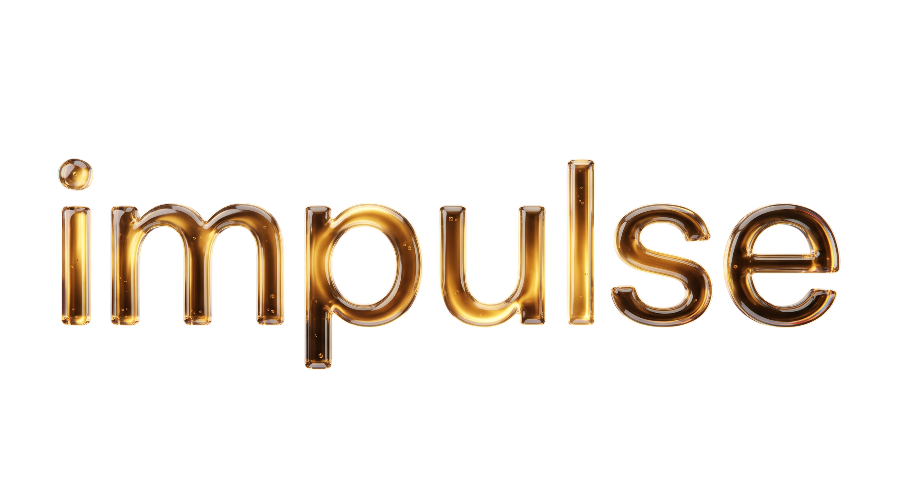
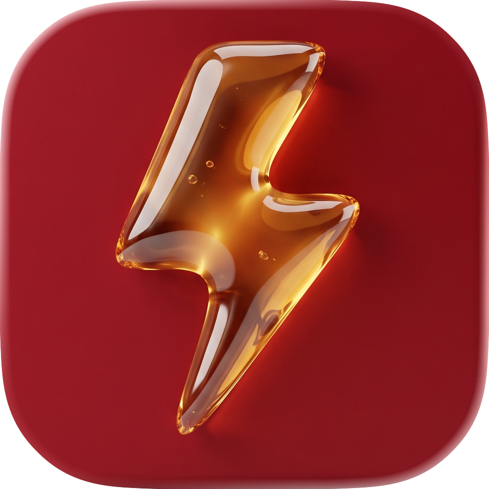

<p align="center">
  
</p>

<p align="center">
  <strong>Play Windows games on Apple Silicon Macs</strong>
</p>

<p align="center">
  
</p>

---

Impulse is a lightweight virtual machine for Apple Silicon Macs, built with gaming in mind. It runs KDE Plasma in a window and uses your Mac’s GPU for Vulkan and OpenGL instead of falling back to software rendering.

Use it to run Windows games through Proton, Linux games, development tools, or just a regular Linux desktop. x86 Linux applications can also run through FEX.

## What you need

- A Mac with Apple Silicon (M1 or newer)
- macOS 26 or later

## Getting started

<p align="center">
  <a href="https://youtu.be/3J96V699CGA">
    
  </a>
</p>

**1.** Download the latest build from [**Releases**](https://github.com/Zonharo/impulse/releases), or build the app yourself (see [Building](#building)).

**2.** Grab a config file from [`examples/gaming.impulse`](examples/gaming.impulse), or paste this into **Terminal** to create one:

```bash
cat > "$HOME/gaming.impulse" <<'EOF'
format_version = 1

memory_mib = 16384
vcpus = 8

disk = "gaming.raw"
disk_size_gib = 32 // You cannot shrink it
EOF
```

The file lands in your home folder (`gaming.impulse` in the main user directory on your Mac). Move it and keep it wherever you want your VM files. The virtual disk image is created next to the config file in that same folder. Choose `disk_size_gib` with care — you can **grow the disk later** by stopping the VM, increasing the value, and launching again, but **you cannot shrink it** once the disk image exists.

**3.** Open Impulse and pick your `.impulse` file.

If macOS blocks the app on first launch (it isn’t signed or notarized), go to **System Settings → Privacy & Security → Open Anyway**.

**4.** Wait for Linux to boot, set up a user, and log in.

Every launch takes a moment to get going — that’s normal. **The first launch takes significantly longer** while Impulse finishes setting up the guest in the background; let it complete before judging boot time.

**5.** Open **Applications → Games → Steam**, sign in, install something, and play — or use the desktop for whatever you need.

## What Impulse gives you

| | |
| :--- | :--- |
| **Graphics** | Hardware-accelerated Vulkan and OpenGL |
| **Games** | Windows titles via Proton, Linux-native builds, x86 games via FEX |
| **Desktop** | KDE Plasma on Wayland — familiar, modern, works with Steam |
| **Day-to-day** | Sound, networking, shared clipboard, Retina and high-refresh displays |

DirectX 9–11 games tend to work best today. Newer APIs are still catching up.

## Building

You’ll need macOS 26+, Xcode, Rust, and Docker.

```sh
brew install cmake meson ninja pkg-config python
make app
```

Output: `dist/Impulse.app`. Guest image artifacts land in `build/guest/`.

To launch straight from the build tree:

```sh
make run
```

That uses `examples/gaming.impulse` by default.

## Thanks

Impulse’s graphics stack builds on forks maintained by the [UTM](https://mac.getutm.app/) project. Big credit to everyone who made that possible.
